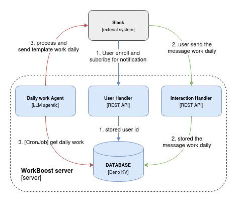

# Work Boost

Work Boost is a productivity tool designed to help you manage and track your daily work tasks efficiently.



## Features

- **Task Management**: Easily add, update, and delete tasks.
- **Daily Reports**: Generate daily work reports.
- **Integration with Google Generative AI**: Leverage AI to enhance your productivity.

## Installation

1. Clone the repository:
    ```sh
    git clone https://github.com/yourusername/work-boost.git
    ```
2. Navigate to the project directory:
    ```sh
    cd work-boost
    ```
3. Install dependencies:
    ```sh
    deno task install
    ```

## Usage

1. Set up your environment variables:
    ```sh
    export GOOGLE_API_KEY=your_google_api_key
    ```
2. Start the development server:
    ```sh
    deno task dev
    ```

## Testing

Run the tests using the following command:
```sh
deno test